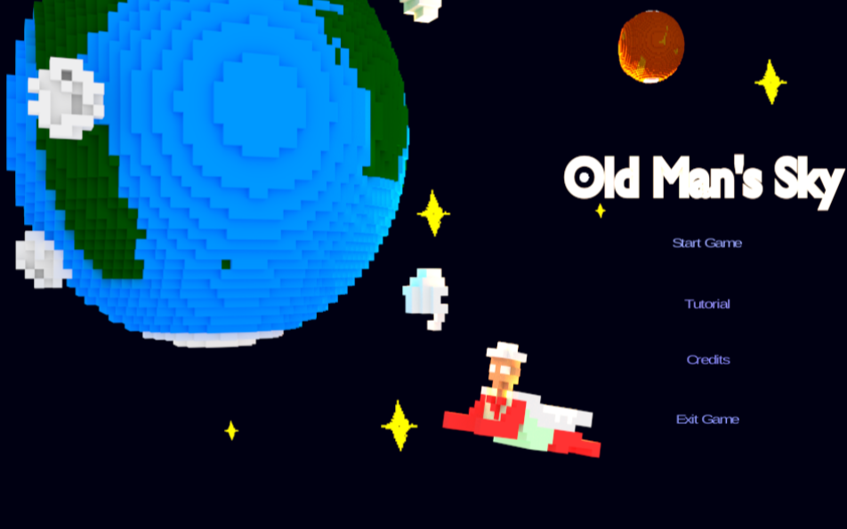
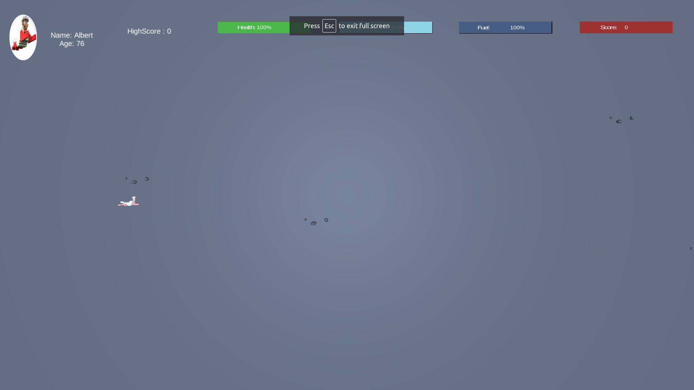
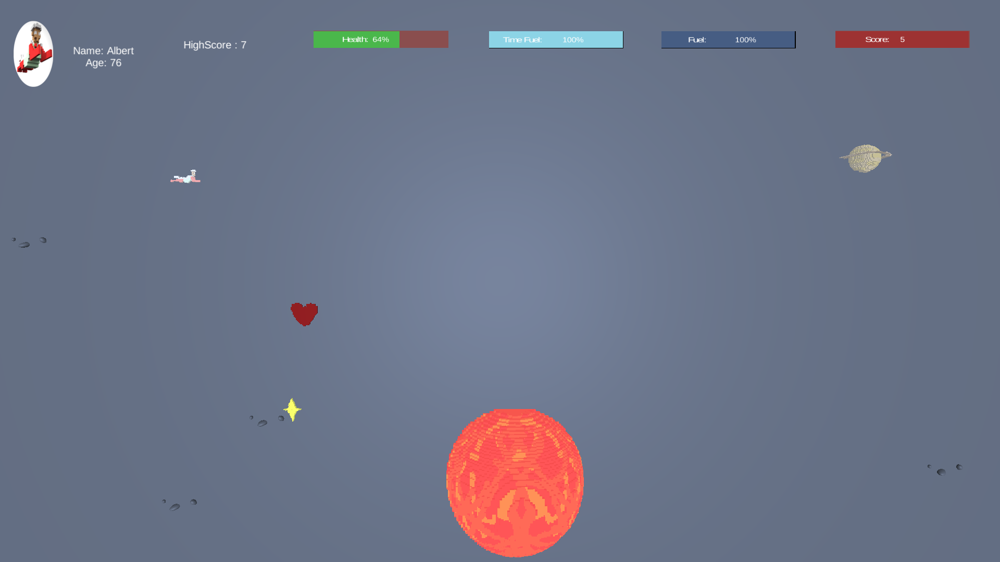
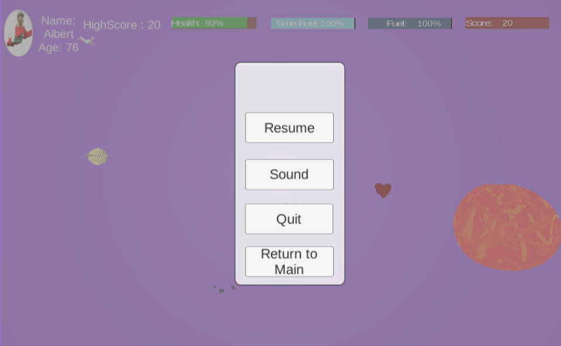
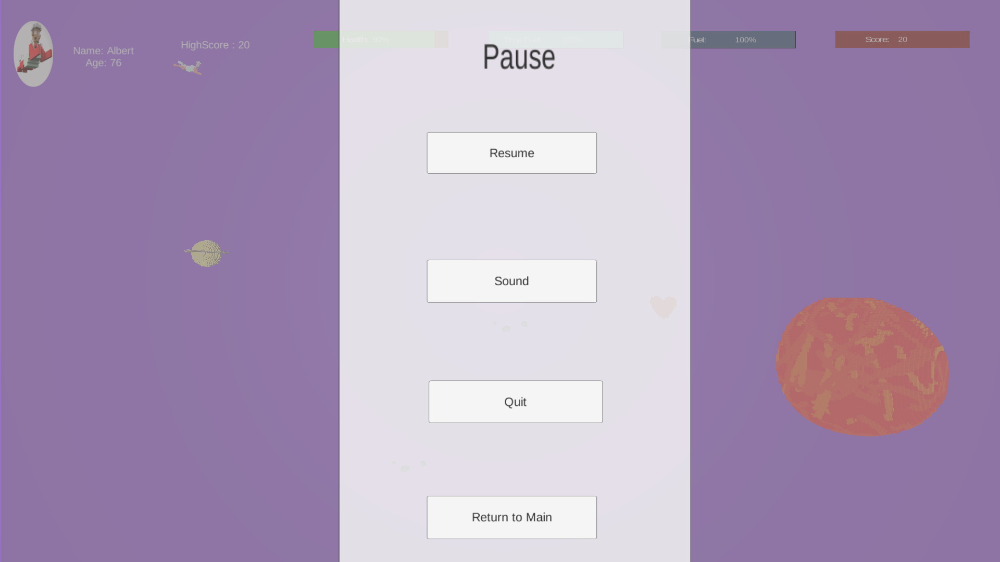
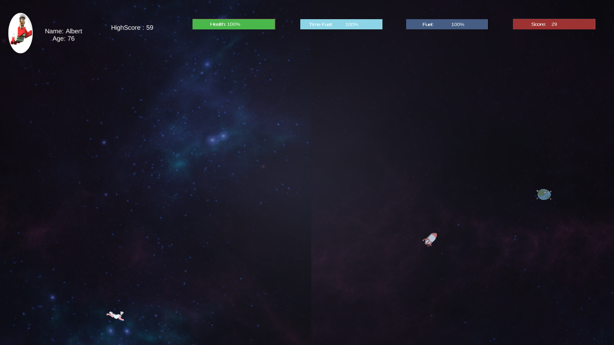

# Old Mans Sky
Infinite runner game project created for Comp 50H class. 
## Screenshots

## Controls
- Up
- Down
- Left
- Right
- L-Control: Use rocket fuel to boost speed
- Space: Slow time and speed
## Version
This game is in the beta version. More feature will be added.
This is build with Unity 5.6 but it should be able to be opened with new versions of Unity
## Modeling 
For this game I used the open source software Magicavoxel to create all the charaters and planets.
https://ephtracy.github.io/
## UI
I used Blender to create to background of the loading screen, and some other assets used in the game
## Notice
Due to the University closing down Student AFS space, the game is no longer on the previous website. 
It is now on https://kamisch.github.io/OldMansSky/
